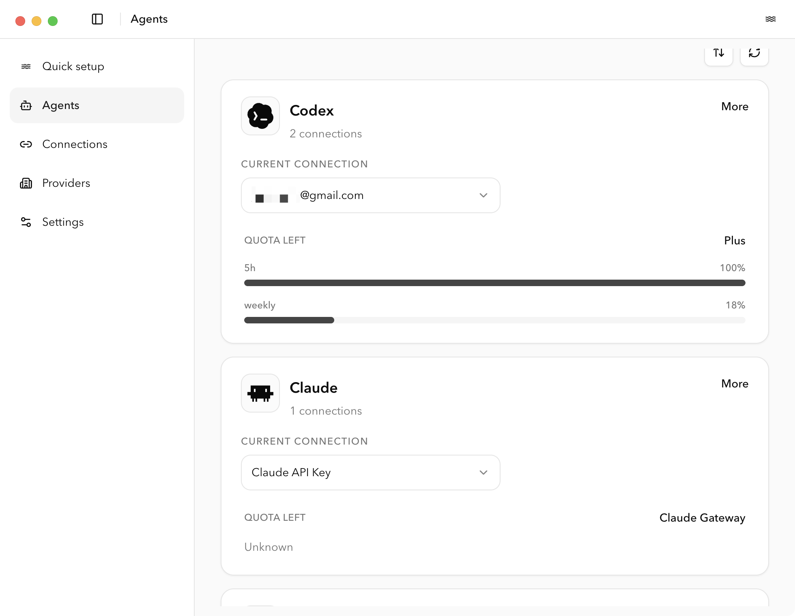
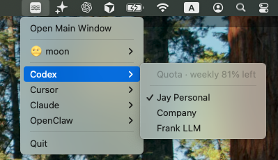
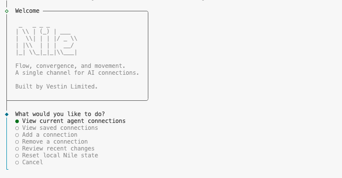

# Nile

<p align="center">
  
</p>

Nile is a macOS app for people who work across multiple AI accounts, providers, and local agent tools.

It gives you one place to save connections, switch the active setup for local tools like Codex, Claude, Cursor, Gemini CLI, and OpenClaw, and keep those changes understandable instead of hidden across scattered config files.

## Why Nile

If you regularly move between personal and work accounts, direct provider APIs and gateway endpoints, or different agent tools, local setup gets messy fast. Nile is built to make that switching predictable.

With Nile you can:

- save multiple AI connections in one place
- switch the active connection for supported local agents
- keep secrets in macOS Keychain instead of plain text files
- see what is currently active, what is saved, and where things have drifted
- use either a desktop UI or a CLI, depending on how you work

## What It Supports Today

Current surface area:

- macOS desktop app
- command-line interface
- local connection switching for `codex`, `claude`, `cursor`, `gemini`, and `openclaw`

Current connection types:

- OpenAI API keys
- OpenAI session auth imported from Codex
- OpenClaw-compatible OpenAI session auth
- Claude session auth
- Cursor session auth
- Gemini CLI Google session auth
- provider-compatible gateway endpoints
- Azure OpenAI endpoints

Current provider presets:

- OpenAI
- Gateway
- Azure OpenAI
- Anthropic
- Cursor
- Gemini CLI

Current caveats:

- Gemini connection add/sign-in is supported, but Gemini quota and usage reporting are not yet available in Nile.
- Nile is built to carry forward existing local state across upgrades. If an older local state shape becomes incompatible, Nile should fail with a recoverable reset path instead of silently dropping state.

## How It Feels

Nile is designed around a simple loop:

1. Add or import a connection.
2. See which agents that connection can support.
3. Save it once.
4. Switch when needed.
5. Check status, history, and usage-aware signals when something changes.

The goal is not to be another chat UI. Nile sits underneath the tools you already use and manages the local connection layer around them.

## Current Status

Nile is still early, but the core workflow is real and working:

- desktop setup and switching flow
- CLI setup and switching flow
- macOS keychain-backed secret storage
- signed and notarized desktop release pipeline for macOS

Current limits:

- macOS only
- local tooling workflows only
- Windows and Linux support are not in scope yet

## Product Surfaces

### Desktop app



The desktop app is the primary Nile surface. This is where you add connections, review supported agents, save authenticated sessions, and switch active local setups without digging through scattered config files.

### Menubar



The menubar gives you a lighter-weight status and switching surface. It is useful when you want to quickly check what is active, inspect saved connections, or change context without opening the full desktop window.

### CLI



The CLI is for local workflows, scripting, and terminal-first usage. It exposes the same connection model in a form that fits automation and fast inspection.

Common CLI entry points:

```bash
nile status
nile list
nile add
nile codex import
nile codex use <connectionId>
nile cursor usage auto-bind <connectionId>
```

`nile status`, `nile list`, and `nile history` are human-readable by default. Add `--json` when you want structured output.

Canonical project terms live in [GLOSSARY.md](./GLOSSARY.md).

## Development

Install dependencies:

```bash
npm install
```

Run typecheck:

```bash
npm run typecheck
```

Run tests:

```bash
npm test
```

Run the CLI locally:

```bash
npm start
```

Build the desktop app shell:

```bash
npm run desktop:build
```

Start the desktop app locally:

```bash
npm run desktop:start
```

Package the desktop app locally without signing:

```bash
npm run build:app:unsigned --prefix apps/desktop
```

For signed desktop release operations, see [docs/desktop-release.md](./docs/desktop-release.md).

## Repository Layout

- `apps/desktop`: Electron desktop app
- `apps/cli`: CLI surface
- `packages/core`: shared connection, credential, and apply logic
- `packages/host-local`: host-specific local integrations
- `assets/icons`: shared brand assets
- `docs`: supporting documentation

## License

MIT. See [LICENSE](./LICENSE).
